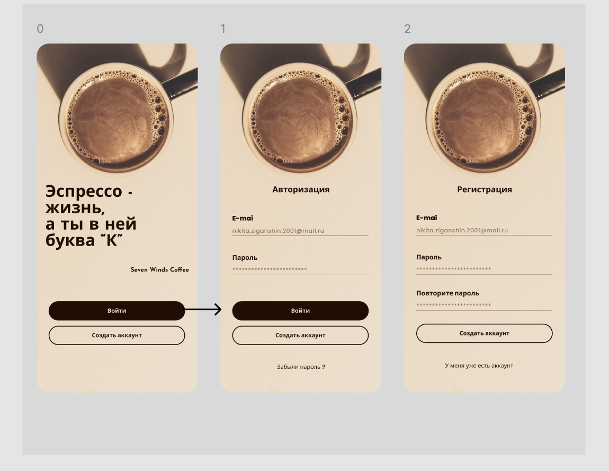
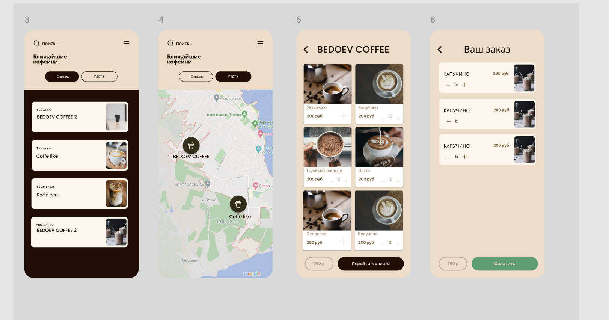
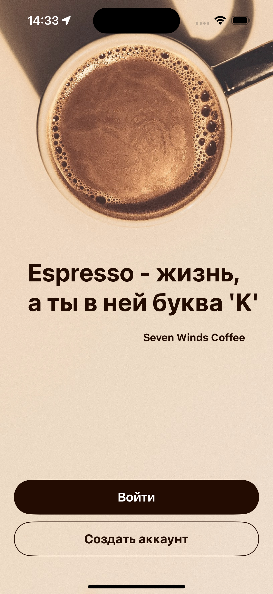
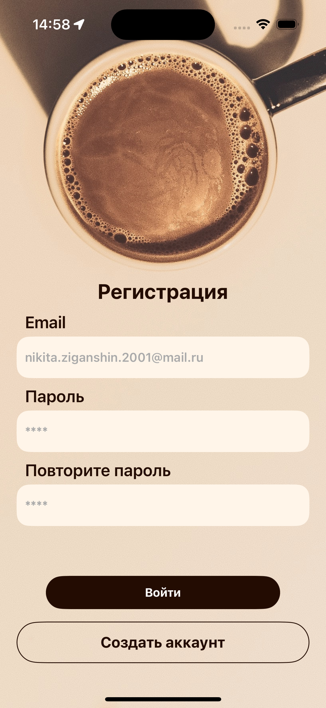
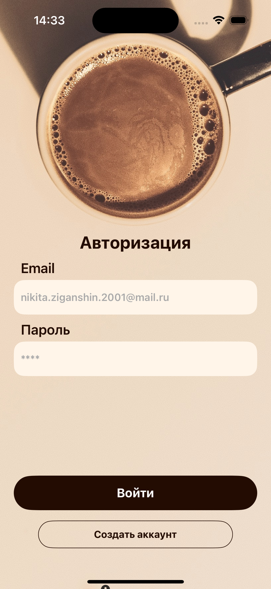
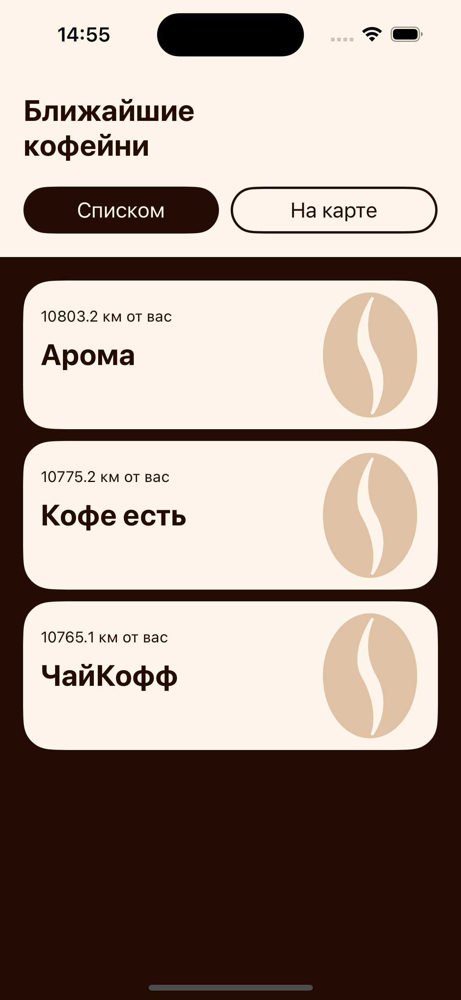
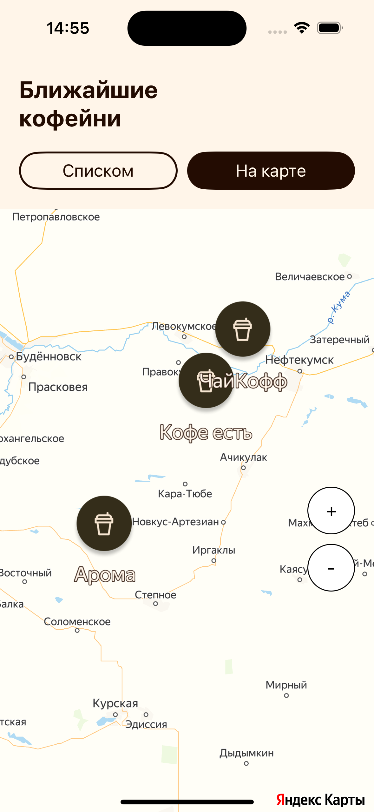
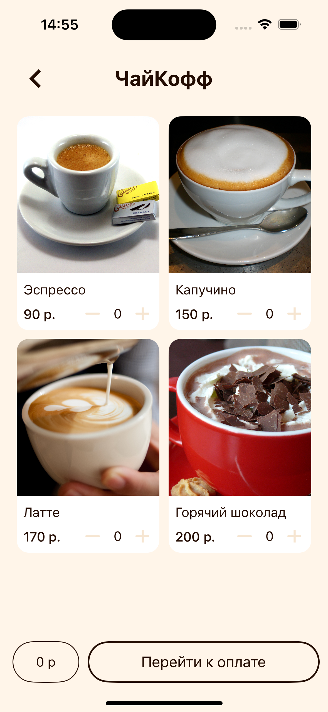
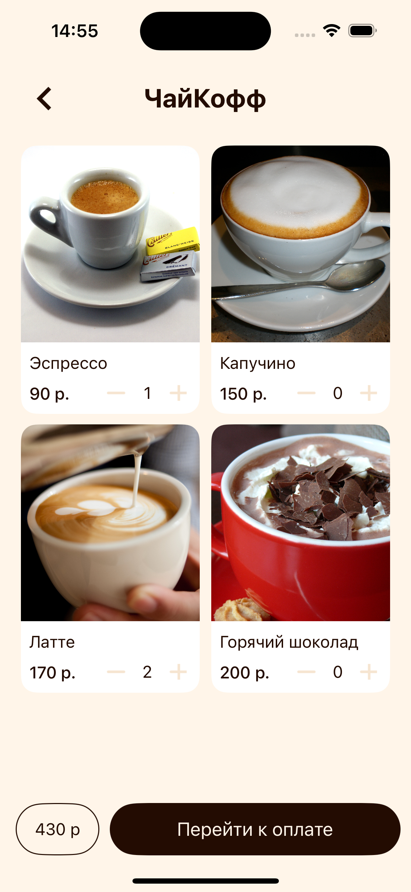
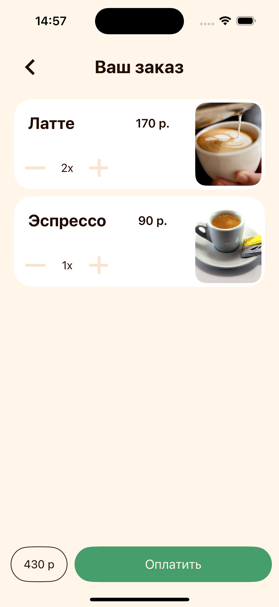

# CoffeePlace
--

## О работе 

Задание показалось интересным, поэтому первым делом я создал небольшой референс интерфейса в Figma.
В процессе верстки немного отошел от дизайна, добавил анимацию и немного приятных деталей. 

[Ссылка на мой реф в Figma](https://www.figma.com/design/jYEK7bMXnrUNrdvviNEBrg/Coffe-17.06-Finish?node-id=10301-85&t=GB5gkMEKblIdQWBb-1)

| Макет 1                                      | Макет 2                                      |
|----------------------------------------------|----------------------------------------------|
|    |    |

## Скриншоты

0. **Превью**  
   

1. **Экран регистрации и Экран входа**  
   

2. **Экран ближайших кофеен список/карта**  
       

3. **Экран меню кофейни**  
       

4. **Экран вашего заказа**  
   
   - Отображение выбранных на предыдущем экране пунктов заказа

---
